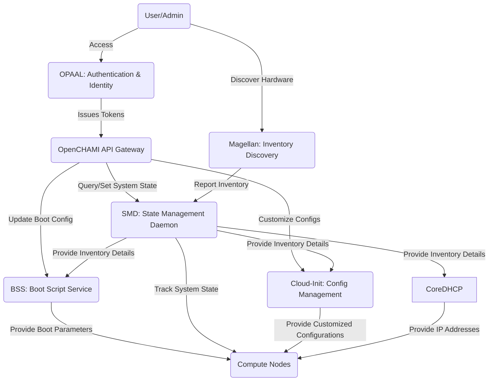

OpenCHAMI is a modular system management framework designed to support **High Performance Computing (HPC)** environments with **cloud-like scalability and security**. This section provides an overview of its core architecture and how its components interact.

## 🔧 Core Components

- **BSS (Boot Script Service):** Handles customized boot parameters for compute nodes.
- **SMD (State Management Daemon):** Maintains inventory and node health status.
- **Magellan:** Discovers and manages server hardware using Redfish APIs.
- **OPAAL:** Handles authentication and authorization (OIDC-based).
- **Configurator:** Dynamically generates configuration files from templates.

## 🔄 How Components Interact

OpenCHAMI follows a **microservices-based** approach where each service operates independently but communicates through a secure API. Below is a high-level diagram illustrating these interactions:

## 🚀 Key Architectural Benefits

✅ **Security-First Design** – Implements **zero-trust authentication**, fine-grained **access control**, and **OIDC-based authorization**.  
✅ **Composable & Scalable** – Modular microservices allow for flexible deployments across **cloud and on-prem** environments.  
✅ **Microservices-Based** – Each component operates independently, ensuring **fault tolerance and easy upgrades**.  
✅ **Cloud-Like Flexibility** – HPC system management with the **efficiency of cloud platforms**.  

## 📌 Next Steps

- Learn more about **[Early Design Decisions](/architecture/design_decisions/)**.
- Dive deeper into **[Security & Authentication](/architecture/security/)**.
- Explore how to **[Deploy OpenCHAMI](/guides/getting_started/)**.
