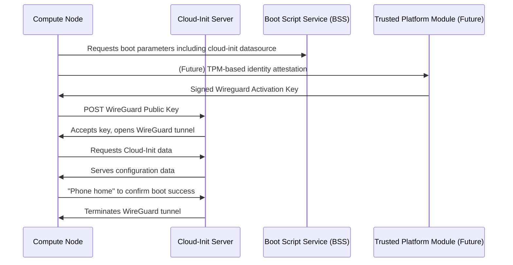

# 🔐 A New Approach to Security: How OpenCHAMI Eliminates Hardcoded SSH Keys

## *Moving Beyond Embedded Credentials in HPC Bootstrapping*

---

## **🔧 The Problem: SSH Public Keys as an Access Control Mechanism in HPC**
For decades, HPC system administrators have relied on a **trusted, but flawed** method to manage cluster nodes: embedding **public SSH keys** in system images. These keys themselves are **not secrets**—they simply allow access to anyone who holds the corresponding private key.  

In traditional HPC environments, this model was necessary because **configuration management tools** (such as Ansible, Puppet, or SaltStack) needed **remote SSH access** to each node in order to:
- ✅ Install necessary dependencies  
- ✅ Configure environment settings  
- ✅ Apply security policies before running jobs  

This worked **well enough in isolated clusters**, but as **HPC systems grow and integrate with cloud-like environments**, the security weaknesses of this model become clear:  

- 🛑 **If a system image is leaked, so is the access mechanism.**  
- 🛑 **Anyone with the private key can remotely access all nodes.**  
- 🛑 **Configuration tools require persistent, broad access across the cluster.**  
- 🛑 **Rotating keys requires updating all images and redistributing them—slow and error-prone.**  

Simply put: **the SSH key model grants access by default**—and that’s not good enough for modern, scalable, and secure HPC management.  

**OpenCHAMI flips this model upside-down** by shifting **from credential-based trust** to **machine-verified identity authentication**. Instead of granting remote access via a public key, OpenCHAMI requires nodes to **authenticate themselves** dynamically, using ephemeral **WireGuard tunnels** that exist only long enough for bootstrapping.

---

## **🔐 OpenCHAMI’s Secure Cloud-Init Workflow**

Rather than relying on **user-based credentials** (like SSH keys), OpenCHAMI shifts the root of trust to **machine-based authentication**. We use a combination of **WireGuard VPN tunnels** and **cloud-init** to establish **secure identity before provisioning even begins**.

### **1️⃣ The Node Introduces Itself**  
When a node powers on, it **generates its own WireGuard keypair** and sends **only its public key** to the cloud-init server via an HTTP POST request.

🔹 **What’s missing here?**  
There’s no **pre-shared secret**, no **hardcoded credential**, and no **default SSH key** embedded in the system image.  

The node is saying, **"Here's who I am. If I belong here, let’s talk securely."**

---

### **2️⃣ The Cloud-Init Server Responds with Silence (and Security)**  
Unlike traditional systems, the cloud-init server **doesn’t send back any credentials**. Instead, it **registers the node’s WireGuard public key** and **allows a private VPN tunnel to open**.

Once this tunnel is established, the node can securely retrieve **all the data it needs** to complete provisioning—without ever exposing secrets over an insecure channel.

---

### **3️⃣ The Boot Process Becomes Secure by Default**  
Now that a **private WireGuard tunnel** exists, the node needs to get its configuration from cloud-init. But here’s the catch:

🔒 **The cloud-init data source is only accessible inside the WireGuard tunnel.**  

That means:
- Nodes **without a valid WireGuard tunnel are completely locked out** from cloud-init.  
- Configuration data is never exposed over an **open network**.  
- Only **verified nodes** receive the information they need to boot successfully.  

---

### **4️⃣ The Tunnel is Temporary**  
One of the biggest weaknesses of **SSH key-based systems** is that access is persistent. A compromised SSH key can be used for months or years before it’s rotated.

We fix that too. 

Once the node **completes provisioning**, it **phones home** to OpenCHAMI, confirming that the provisioning process is complete. As soon as that happens:

🚫 **The WireGuard tunnel is automatically deactivated on the cloud-init server.** 🚫

The tunnel exists **only as long as it’s needed**, preventing long-term exposure to potential attacks.

---

## **🔮 The Next Evolution: TPM-Based Authentication**  
Right now, OpenCHAMI’s identity verification is based on **network validation and WireGuard keys**. That alone is a massive improvement over SSH keys.

But we’re taking it even further.

### **Enter TPM-Based Attestation** 🔐  
The **next step in OpenCHAMI’s security model** is to integrate **Trusted Platform Module (TPM) authentication**. Instead of trusting a node just because it has the right network/IP, we’ll soon allow nodes to prove their identity using **hardware-backed cryptographic signatures**.

- ✅ Each node will have a **unique TPM key**, locked to its hardware.  
- ✅ Instead of sending a simple key, it will **sign an identity attestation** that the cloud-init server can verify.  
- ✅ This prevents **spoofing attacks**, ensuring only **real, trusted nodes** can join the cluster.  

---

## **🚀 What This Means for HPC Security**  
OpenCHAMI **completely eliminates** the need for **static, pre-shared SSH keys** in HPC system management. Instead, we shift to a **dynamic, machine-based authentication model** that is:

✔️ **More Secure** – No more **hardcoded credentials** inside system images.  
✔️ **More Flexible** – Works seamlessly across **on-prem and cloud HPC environments**.  
✔️ **More Automatic** – Nodes authenticate **themselves**, without admin intervention.  
✔️ **More Temporary** – VPN tunnels **disappear** once they’re no longer needed.  

And best of all? **No root SSH key is ever needed.**  

---

## **💡 Final Thoughts**  
Security in HPC is **long overdue for an upgrade**. With OpenCHAMI, we’re proving that **there is a better way**.

By integrating **WireGuard for secure bootstrapping**, **cloud-init for automated provisioning**, and **TPM for next-gen identity verification**, we’re building an HPC security model that is **safer, smarter, and built for the future**.

---

## **🔧 Want to Learn More?**  
We’re actively improving OpenCHAMI’s security model, and we’d love your feedback.  
💬 **Join the conversation in our [community](https://github.com/openchami/community).**  
🔧 **Contribute to the project on [GitHub](https://github.com/openchami).**  
📖 **Explore our [documentation](/docs/software/).**  

🚀 **HPC security is changing—be part of the future.**  

