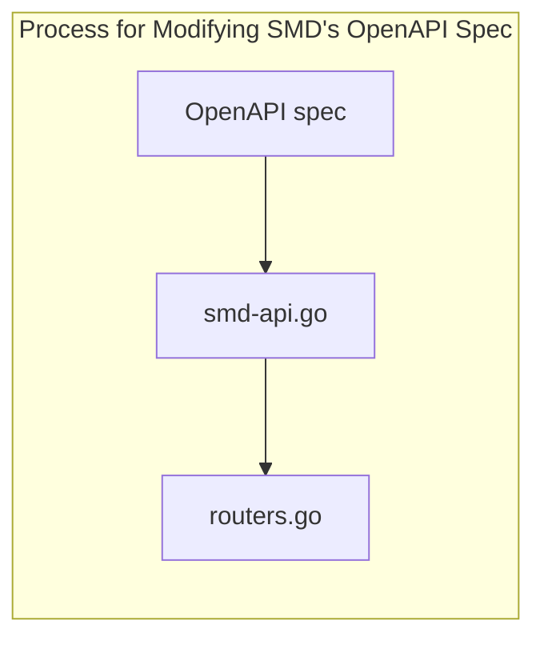

+++
title = 'Experimental Refactoring with SMD'
date = 2024-01-24T10:24:44-05:00
draft = false
categories = ['LANL', 'Development']
contributors = ["David J. Allen (LANL)"]
+++


For the OChami demo at SC 2023, two of the CSM microservices were needed to boot a 10-node cluster: the boot-script service (BSS) and the state management database (SMD). While working with the code for the demo, it was discovered that both microservices are packed with features not necessary for booting. This eventually led to evaluating more of the code the see what could be changed or simplified down to slimmer microservices. For the goals of OChami, it would be better if some of these features could be separated and refined into something that is more focused and can easily be migrated to cloud systems. 


## Making Changes to the API

At first glance, modifying parts of SMD seems like a tricky thing to do because of the tight coupling of the abstractions. Therefore, it made sense to not touch any of the structs or functions first as that would more likely lead to something else breaking unexpectedly. Instead, it made more sense to try removing endpoints from the OpenAPI specification and work backwards. The spec can be found in `api/swagger_v2.yaml` and defines multiple endpoints that look like the following below:

```yaml
/State/Components/BulkEnabled:
    patch:
      tags:
        - Component
      summary: >-
        Update multiple components' Enabled values via a list of xnames
      description: >-
        Update the Enabled field for a list of xnames. Specify a single
        value for Enabled and also the list of xnames. Note that Enabled is a boolean field
        and a value of false sets the component(s) to disabled.
      operationId: doCompBulkEnabledPatch
      parameters:
        - name: payload
          in: body
          required: true
          schema:
            $ref: '#/definitions/ComponentArray_PatchArray.Enabled'
      responses:
        "204":
          description: Success.
        "400":
          description: Bad Request
          schema:
            $ref: '#/definitions/Problem7807'
        "404":
          description: Does Not Exist
          schema:
            $ref: '#/definitions/Problem7807'
        default:
          description: Unexpected error
          schema:
            $ref: '#/definitions/Problem7807'
```

The important thing to note here is the `operationId` field which corresponds to a function defined in the `smd-api.go` file. This is what we would find if we look there:

```go
// Update component 'Enabled' boolean for a list of components
func (s *SmD) doCompBulkEnabledPatch(w http.ResponseWriter, r *http.Request) {
    s.compBulkPatch(w, r, EnabledUpdate, "doCompBulkEnabledPatch")
}
```

If we comment out the above function in `smd-api.go`, an error in the `routers.go` file will appear as it is being used there. This was the only kind of error I found to occur when trying to remove more endpoints from the spec and from `smd-api.go`. If we want to run the SMD tests for the API, it may be necessary to remove the tests for each function removed in `smd-api_test.go`, but it was not needed to compile the binaries.

Finally, try compiling the code with any changes made with the following commands:

```bash
GOOS=darwin GOARCH=arm64 go build -o smd -v -tags musl $(LDFLAGS) ./cmd/smd
GOOS=darwin GOARCH=arm64 go build -o smd-init -v -tags musl $(LDFLAGS) ./cmd/smd-init
GOOS=darwin GOARCH=arm64 go build -o smd-loader -v -tags musl $(LDFLAGS) ./cmd/smd-loader
```

Note that the go environment variables are set to test on a M2 Mac so that might need to be changed for your system. The `GOOS` and `GOARCH` variable values can be found [here](https://gist.github.com/asukakenji/f15ba7e588ac42795f421b48b8aede63). Alternatively, calling `make binaries` in the root of the SMD repository will do the same thing as above.

## Conclusion

The main takeaway from this little experiment is that the OpenAPI spec for SMD can easily be modified to some extent without breaking the entire microservice. So far, the process for modifying the API for SMD can be summed up simply by the diagram below:



Moving forward, it may be interesting to look at some of the other parts of SMD to see what can be moved into separate microservices, modified, updated, or replaced altogether. 
